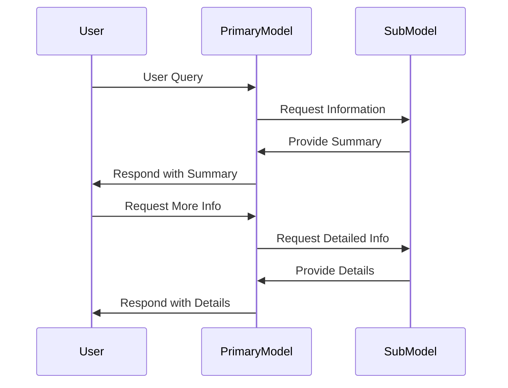
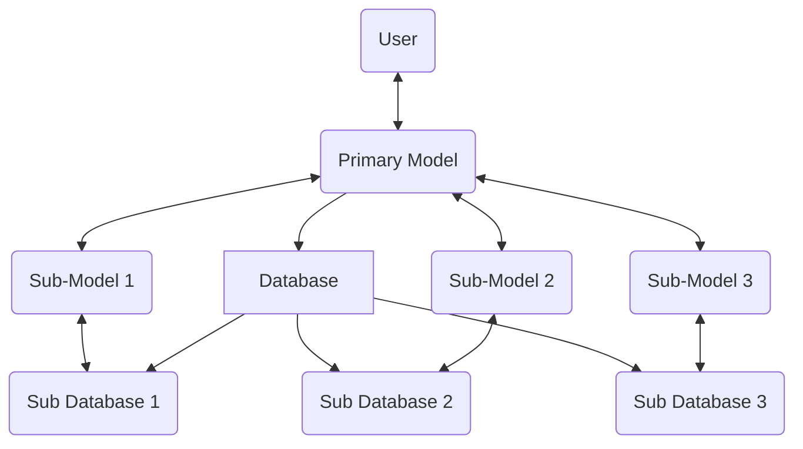

### ARK (Adaptive Resource Kernel)

**ARK** is an implementation of model resourcing based on user query where the primary model has the entire chat and decides which sub-model to ask for the relevant information required by the user. These sub-models' lifetime is short-lived, whereas the primary model's lifetime is long-lived and has the entire context in a summarized way.

This repository will contain the first iteration of the above idea.

### Flow of the ARK

1. **User Query**: The user query is passed to the primary model.
   - Example: "I would like to speak to one of the Sarathis."
2. **Primary Model Decision**: The primary model decides which sub-model to ask for the relevant information.
   - Example: Knowing both the User and all Sarathis, the sub-model returns the most relevant Sarathis in a summarized way.
3. **Primary Model Response**: The primary model then uses the information to respond to the user.
   - Example: "Sure, I can connect you to Sarathi 1. Would you like to know more about him?"
4. **User Follow-up**: The user can then ask for more information about the Sarathi.
   - Example: "Yes, I would like to know more about Sarathi 1."
5. **Detailed Information Retrieval**: The primary model then asks the sub-model for more information about the Sarathi.
   - Example: The sub-model returns the detailed information about Sarathi 1.
6. **Final Response**: The primary model then uses the information to respond to the user.
   - Example: "Sarathi 1 is ..."

The sub-model only lives for one query and doesn't have any memory. The primary model has the entire context and can decide which sub-model to ask for the relevant information.

### ARK's Architecture

1. **Primary Model (Context Keeper)**
   - **Role**: Maintains the full conversation context in a summarized way and orchestrates communication between the user and sub-models.
   - **Functions**:
     - Interprets user queries.
     - Decides which sub-model to invoke for specific tasks.
     - Aggregates and presents responses from sub-models to the user.
   - **Persistence**: Long-lived, maintaining memory and context over the course of the conversation.

2. **Sub-Models (Task Executors)**
   - **Role**: Perform specialized tasks based on the instructions from the primary model.
   - **Functions**:
     - Retrieve and process specific information relevant to the user query.
     - Provide responses back to the primary model.
   - **Persistence**: Short-lived, stateless, and exist only for the duration of a single query.

### ARK's Features

- **Separation of Concerns**:
  - The primary model is responsible for decision-making and maintaining the conversation’s overall flow and memory.
  - Sub-models are task-specific and stateless, ensuring focused and efficient execution.
- **Dynamic Sub-Model Selection**:
  - The primary model dynamically selects the most relevant sub-model based on the user query and context.
- **Stateless Sub-Models**:
  - Sub-models do not maintain memory, reducing resource consumption and simplifying implementation.
- **Scalability**:
  - New sub-models can be added to handle specific tasks or domains without modifying the primary model.