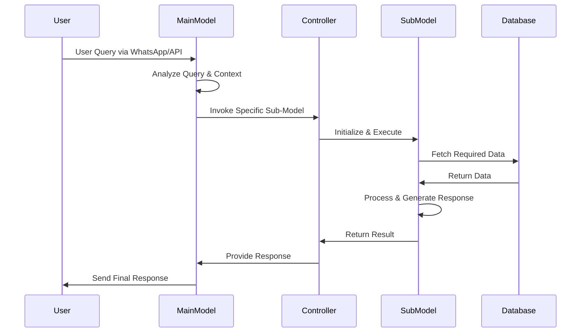
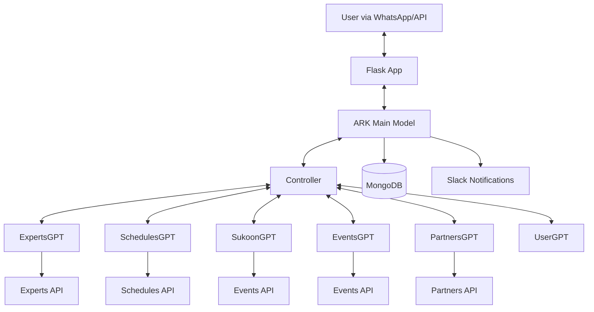

## ARK-I (Adaptive Resource Kernel - Implementation)

**ARK-I** is an intelligent AI orchestration system that uses a hierarchical model architecture to handle complex user interactions. The primary model (MainGPT) maintains conversation context and dynamically delegates specialized tasks to domain-specific sub-models. This architecture enables efficient resource utilization by keeping sub-models stateless and short-lived while the primary model maintains long-term context.

This repository contains the first production implementation of ARK, designed for senior support and wellness services.

### How ARK Works


```mermaid
sequenceDiagram
    participant User
    participant MainModel
    participant Controller
    participant SubModel
    participant Database
    User->>MainModel: User Query via WhatsApp/API
    MainModel->>MainModel: Analyze Query & Context
    MainModel->>Controller: Invoke Specific Sub-Model
    Controller->>SubModel: Initialize & Execute
    SubModel->>Database: Fetch Required Data
    Database->>SubModel: Return Data
    SubModel->>SubModel: Process & Generate Response
    SubModel->>Controller: Return Result
    Controller->>MainModel: Provide Response
    MainModel->>User: Send Final Response
```

**Key Workflow Steps:**

1. **User Input**: User sends a message via WhatsApp or API endpoint
2. **Main Model Processing**: The primary model (MainGPT) receives the query and analyzes the conversation context
3. **Tool Invocation**: Based on the query, MainGPT decides which assistant/sub-model to invoke using function calls
4. **Controller Orchestration**: The Controller manages sub-model lifecycle and routing
5. **Sub-Model Execution**: The invoked sub-model executes its specialized task (e.g., fetching expert details, managing schedules)
6. **Response Synthesis**: MainGPT aggregates sub-model responses and formulates a coherent reply
7. **User Response**: The final message is sent back to the user

**Important Characteristics:**
- Sub-models are **stateless** and **ephemeral** - they exist only for a single query
- Main model is **stateful** - maintains full conversation history in MongoDB
- Communication between models uses **function calling** with structured schemas

### System Architecture


```mermaid
graph TD
    A[User via WhatsApp/API] <--> B[Flask App]
    B <--> C[ARK Main Model]
    C <--> D[Controller]
    D <--> E1[ExpertsGPT]
    D <--> E2[SchedulesGPT]
    D <--> E3[SukoonGPT]
    D <--> E4[EventsGPT]
    D <--> E5[PartnersGPT]
    D <--> E6[UserGPT]
    
    C --> DB[(MongoDB)]
    E1 --> API1[Experts API]
    E2 --> API2[Schedules API]
    E3 --> API3[Events API]
    E4 --> API4[Events API]
    E5 --> API5[Partners API]
    
    C --> Slack[Slack Notifications]
```

**Component Breakdown:**

1. **Flask API Server** (`app.py`, `run.py`)
   - Exposes REST endpoint `/ark` for incoming requests
   - Handles WhatsApp webhook integration
   - Manages async response threading
   - Runs on port 5000 with Gunicorn

2. **Main ARK Module** (`index.py`)
   - **ARK Class**: Core orchestration logic
   - Manages conversation history in MongoDB
   - Handles GPT-4 interactions via OpenAI API
   - Implements rate limiting and error handling
   - Processes tool/function calls from GPT-4

3. **Controller** (`models/controller.py`)
   - Routes requests to appropriate sub-models
   - Manages sub-model lifecycle
   - Maintains model registry and configuration

4. **Sub-Models** (Specialized Assistants)
   - Each sub-model has its own prompt, tools, and handlers
   - Isolated execution context
   - Stateless operation
   
5. **Chat Engine** (`chat/__init__.py`)
   - Handles sub-model conversation logic
   - Manages tool calling for sub-models
   - Implements retry logic and error recovery

6. **Common Utilities** (`models/common.py`)
   - Shared tools across models
   - Time/date utilities
   - User data retrieval

### Sub-Models (Specialized Assistants)

ARK-I implements **6 specialized sub-models**, each handling a specific domain:

#### 1. **ExpertsGPT** (`models/expertsGPT/`)
**Purpose**: Manages expert (Sarathi) discovery and availability

**Capabilities:**
- Lists all available experts with their personas
- Checks expert availability and time slots
- Retrieves expert schedules
- Matches users with appropriate experts based on personas

**Tools:**
- `GetSlots`: Fetches available time slots for an expert
- `GetSarathiSchedules`: Retrieves upcoming schedules for a specific expert
- `GetCurrentTime`: Gets current time in IST and UTC

#### 2. **SchedulesGPT** (`models/schedulesGPT/`)
**Purpose**: Handles call scheduling and schedule management

**Capabilities:**
- Creates new call schedules with experts
- Cancels existing schedules
- Views user's upcoming schedules
- Manages scheduling conflicts
- Can invoke ExpertsGPT for expert ID validation

**Tools:**
- `CreateSchedule`: Books a call with an expert at specified time (UTC)
- `CancelSchedule`: Cancels an existing schedule
- `ExpertsAssistant`: Delegates to ExpertsGPT for expert information
- `GetCurrentTime`: Time utilities

#### 3. **SukoonGPT** (`models/sukoonGPT/`)
**Purpose**: Manages wellness services and event registrations

**Capabilities:**
- Provides information about Sukoon services
- Registers users for wellness events
- Can invoke EventsGPT for event details

**Tools:**
- `RegisterUserForEvent`: Registers user for an event using event slug
- `EventsandMeetupsAssistant`: Delegates to EventsGPT for event information

#### 4. **EventsGPT** (`models/eventsGPT/`)
**Purpose**: Manages events and meetups information

**Capabilities:**
- Lists all upcoming events
- Provides detailed event information
- Shows user's registered events
- Displays event timings in UTC

**Tools:**
- `GetEventDetails`: Fetches details for a specific event by slug
- `GetUserRegisteredEvents`: Lists events user has registered for
- `GetCurrentTime`: Time utilities

#### 5. **PartnersGPT** (`models/partnersGPT/`)
**Purpose**: Provides information about partner organizations and services

**Capabilities:**
- Information about partner services
- Partner program details

**Tools:**
- `GetCurrentTime`: Time utilities

#### 6. **UserGPT** (`models/userGPT/`)
**Purpose**: Analyzes conversation context for better user understanding

**Capabilities:**
- Interprets conversation history between main and sub-models
- Provides user intent analysis
- Used for error recovery (e.g., failed schedule creation)

**Tools:**
- No tools - purely analytical model

### Key Features

- **Separation of Concerns**:
  - Main model handles orchestration and maintains conversation context
  - Sub-models are task-specific and stateless for efficient execution
  
- **Dynamic Sub-Model Selection**:
  - Main model uses GPT-4's function calling to select appropriate assistants
  - Intelligent routing based on user intent and context
  
- **Stateless Sub-Models**:
  - Sub-models don't maintain memory, reducing resource consumption
  - Fresh context for each invocation ensures focused responses
  
- **Scalability**:
  - New sub-models can be added without modifying existing code
  - Modular architecture supports domain expansion
  
- **Inter-Model Communication**:
  - Sub-models can invoke other sub-models via Controller
  - Example: SchedulesGPT → ExpertsGPT for expert validation
  
- **Robust Error Handling**:
  - Rate limit management with fallback clients
  - Automatic retry logic for failed operations
  - Conversation history truncation when needed
  
- **Production Ready**:
  - WhatsApp integration via webhooks
  - Asynchronous response handling
  - MongoDB for persistent storage
  - Slack notifications for support escalation

### Main Model Tools

The Main ARK model has access to the following tools:

1. **GetUserDetails**: Retrieves user information from database
2. **UpdateUserDetails**: Updates user profile (name, city, email, birthDate, persona)
3. **GetCurrentTime**: Returns current time in IST and UTC formats
4. **GetPreviousCalls**: Fetches user's call history
5. **NotifySupportTeam**: Sends escalation notification to Slack
6. **ExpertsAssistant**: Invokes ExpertsGPT sub-model
7. **ServicesAssistant**: Invokes SukoonGPT sub-model
8. **PartnersAssistant**: Invokes PartnersGPT sub-model
9. **SchedulesAssistant**: Invokes SchedulesGPT sub-model

### API Documentation

#### REST Endpoint

**POST** `/ark`

**Request Body:**
```json
{
  "phoneNumber": "+919876543210",
  "prompt": "I want to talk to a Sarathi",
  "context": "whatsapp",
  "send_reply": true
}
```

**Request Parameters:**
- `phoneNumber` (string, required): User's phone number
- `prompt` (string, required): User's message/query
- `context` (string, required): Context identifier (e.g., "whatsapp")
- `send_reply` (boolean, optional): If true, sends response via WhatsApp asynchronously

**Response:**
```json
{
  "output_message": "Ark is processing your request",
  "output_details": {
    "response": "...",
    "history": [...]
  }
}
```

### Setup and Installation

#### Prerequisites
- Python 3.13
- MongoDB database
- OpenAI API key
- WhatsApp Business API credentials (optional, for WhatsApp integration)
- Slack webhook URL (optional, for notifications)

#### Installation Steps

1. **Clone the repository**
   ```bash
   git clone https://github.com/RamaSai2519/ARK-I.git
   cd ARK-I
   ```

2. **Initialize submodules**
   ```bash
   git submodule init
   git submodule update
   ```

3. **Install dependencies**
   ```bash
   pipenv install
   ```

4. **Configure environment variables**
   Create configuration in the `shared` submodule for:
   - MongoDB connection string
   - OpenAI API keys (primary and fallback)
   - WhatsApp API credentials
   - Slack webhook URL
   - External service API URLs

5. **Run the application**
   
   **Development:**
   ```bash
   python app.py
   ```
   
   **Production:**
   ```bash
   python run.py
   ```
   
   The server runs on `http://0.0.0.0:5000`

### Project Structure

```
ARK-I/
├── app.py                 # Flask application and REST API
├── run.py                 # Production server with Gunicorn
├── index.py               # Main ARK class and orchestration logic
├── chat/
│   └── __init__.py        # Chat engine for sub-models
├── models/
│   ├── controller.py      # Sub-model routing and lifecycle
│   ├── common.py          # Common tools and utilities
│   ├── common_schemas.py  # Shared Pydantic schemas
│   ├── main/              # Main model (primary orchestrator)
│   │   ├── prompt.py      # System prompt generation
│   │   ├── tools.py       # Tool implementations
│   │   ├── tools_schemas.py  # Tool schemas
│   │   └── slack.py       # Slack integration
│   ├── expertsGPT/        # Expert management sub-model
│   ├── schedulesGPT/      # Scheduling sub-model
│   ├── sukoonGPT/         # Wellness services sub-model
│   ├── eventsGPT/         # Events management sub-model
│   ├── partnersGPT/       # Partners information sub-model
│   └── userGPT/           # User analysis sub-model
├── shared/                # Shared utilities (git submodule)
│   ├── configs/           # Configuration management
│   ├── db/                # Database connections
│   ├── helpers/           # Helper functions
│   ├── models/            # Data models and interfaces
│   └── schemas/           # Shared schemas
├── Pipfile                # Python dependencies
└── Readme.md              # This file
```

### Technology Stack

- **Language**: Python 3.13
- **Web Framework**: Flask 3.1.0 with Flask-RESTFUL
- **AI/ML**: OpenAI GPT-4o (gpt-4o-2024-11-20)
- **Database**: MongoDB (PyMongo 4.10.1)
- **Server**: Gunicorn (for production)
- **Messaging**: WhatsApp Business API
- **Notifications**: Slack SDK 3.34.0
- **Additional Libraries**:
  - Boto3 (AWS SDK)
  - Requests (HTTP client)
  - Flask-CORS (CORS handling)
  - Flask-JWT-Extended (authentication)

### Development Notes

#### Adding a New Sub-Model

1. Create a new directory under `models/` (e.g., `models/newGPT/`)
2. Implement three files:
   - `prompt.py`: System prompt generation
   - `tools.py`: Tool implementations and handlers
   - `tools_schemas.py`: Pydantic schemas for tools
3. Register the model in `models/controller.py`
4. Add an assistant tool in `models/main/tools_schemas.py`
5. Update the main tools handler in `models/main/tools.py`

#### Time Format Conventions

- **Display to users**: Indian Standard Time (IST)
- **Internal storage**: UTC
- **API communication**: ANTD Time Format (`%Y-%m-%dT%H:%M:%S.%fZ`)
- **AWS/Database**: AWS Time Format (varies by service)

#### Error Handling

- Rate limits are handled with automatic fallback to secondary OpenAI client
- Failed tool calls trigger retry logic
- Conversation history is truncated when rate limits persist
- Critical errors are logged and notifications sent to Slack

### Contributing

This is a production system for senior support services. For contributions or questions, please contact the repository maintainer.

### License

[Add license information here]
